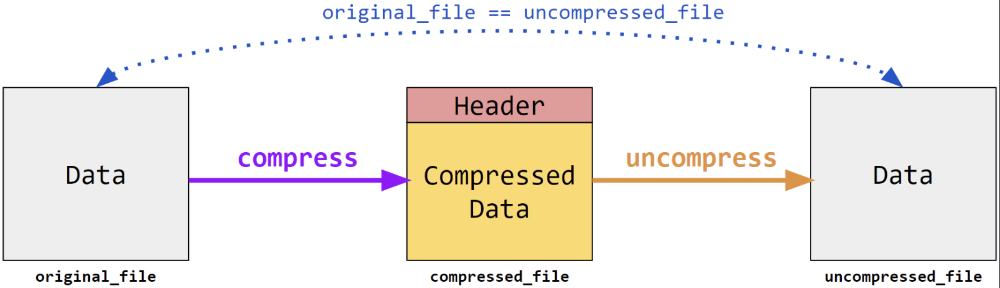

# CSE 100 - Advanced Data Structures and Algorithms

## Project 1 - Huffman Coding

### Overview

In the age of big data, storage efficiency has become a significant challenge. For instance, a single Whole Genome Sequencing experiment can generate over 100 GB of raw data. To address this, computer scientists have long worked on methods to reduce file sizes without losing any information. In this project, we implemented our own file compression tool using the Huffman coding algorithm.

### Project Description

We developed two programs — `compress` and `uncompress` — that utilize Huffman Compression to efficiently reduce file sizes and later restore them to their original form.



#### Compress

The `compress` program takes an input file and generates a compressed version using Huffman encoding. Specifically, we:

- Constructed a Huffman code based on the frequency of characters in the input file.
- Used this code to encode the contents of the file.
- Wrote the encoded data, along with a header containing metadata needed for decoding, to the output compressed file.

#### Uncompress

The `uncompress` program reverses the compression process. It:

- Reads the header from the compressed file to reconstruct the Huffman tree.
- Decodes the contents using the tree.
- Writes the result to an output file, which is guaranteed to be identical to the original input.

To validate correctness, running `diff` between the original and uncompressed file produces no output, confirming that no data was lost:

```
diff uncompressed_file original_file  # should return nothing
```

### Usage

After compiling the project with `make`, the programs can be run as follows:

```
./compress <original_file> <compressed_file>
./uncompress <compressed_file> <uncompressed_file>
```

For grading and testing purposes, we ensured that our solution works with input files up to 10 MB in size.

### Notes

- We were provided reference implementations (refcompress and refuncompress) for guidance. These binaries are matched pairs and were intended for use on the Ed platform.

- Our implementations of compress and uncompress are not required to interoperate with the reference binaries.

- We were free to modify the starter code and Makefile, as long as our final solution could be compiled using make and executed using the specified commands.

### Resources

- [**Project Workflow**](specs/project_workflow.md)
- [**Design Notes**](specs/design_notes.md)
- [**How to Debug**](specs/how_to_debug.md)
- [**Common Issues**](specs/common_issues.md)